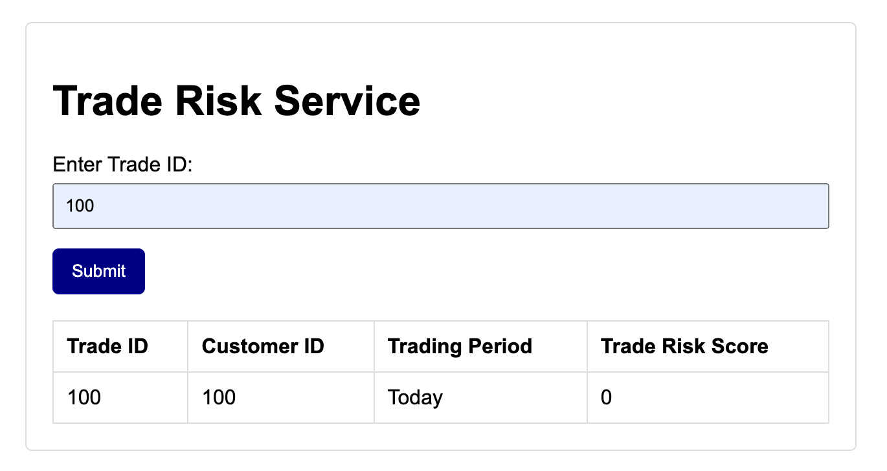

# Trade Risk Micrometer Observability and Monitoring App
This project is a Maven multi-module setup for a TradeRisk application, utilizing Spring Boot and Micrometer for observability. It includes two independent Spring Boot web applications:

1. **trade-manager-service**: Manages trade details and provides trade information through RESTful APIs.
2. **trade-risk-service**: Consumes trade information from the trade-manager-service, applies risk rules, and returns risk evaluation results.


## Key Features

- **Micrometer Integration**: The primary focus of this project is to leverage Micrometer for comprehensive observability. Metrics from both services are collected and published for monitoring and analysis.
- **Elastic Stack**: Observability information is published to Elasticsearch, allowing for powerful search, analysis, and visualization using Kibana.
- **Conditional AWS CloudWatch Integration**: Metrics can also be conditionally published to AWS CloudWatch based on a feature toggle, providing flexibility in monitoring and alerting within AWS environments.
- **Using `concurrently` NPM Package**: Both microservices can be started concurrently using the `concurrently` NPM package, simplifying development and testing.

This setup enables detailed monitoring and insights into the application's performance and behavior, helping ensure reliability and operational efficiency.

### Simple Index HTML Layout 
This is a simple index HTML layout to invoke the Trade Risk service. You just need to double-click on the `index.html` file to open it in a browser. You donot need to run any server to open this HTML file.


## Modules

### trade-manager-service

- **Description**: Manages trade details and provides trade information through RESTful APIs.
- **Technologies**: Spring Boot, Micrometer, Elasticsearch, AWS CloudWatch

### trade-risk-service

- **Description**: Consumes trade information from the trade-manager-service, applies risk rules, and returns risk evaluation results.
- **Technologies**: Spring Boot, Micrometer, Elasticsearch, AWS CloudWatch

## Getting Started

### Project Setup

To set up the project, a script is created that creates the necessary directories, `pom.xml` files, and install the required NPM dependencies.

1. I have run the  `setup-maven-project.sh`
2. Also made the script executable:

```sh
   chmod +x setup-maven-project.sh
```

NOTE: If you using this code repository you do not need to do this Project Setup. This "Project Setup" is documented just as FYI only.

### Prerequisites

- Java 11 or later
- Maven 3.6.3 or later
- Elasticsearch
- AWS account (for CloudWatch integration)
- npm (Node Package Manager)

### Building the Project

To build the project, navigate to the root directory (`TradeRiskMicrometerObsvltyApp`) and run:

```sh
npm run build
```

### Running the Applications

#### ELK Stack
Before starting the applications, ensure that the ELK Stack Docker Compose setup is running. You can start it using the following command:

```sh
npm run start:elk
```

#### trade-manager-service
To start the microservices using npm, you can use the following commands:

```sh
npm run start:trade-manager-service
```

#### trade-risk-service

```sh
npm run start:trade-risk-service
```

#### Start both services concurrently:
```sh
npm run start:all
```

### Stopping the Applications
To stop the microservices, you can use the following commands:

#### trade-manager-service

#### Stop the trade-manager-service:

```sh
npm run stop:trade-manager-service
```
#### Stop the trade-risk-service

```sh
npm run stop:trade-risk-service
```

#### Stop both services concurrently:
```sh
npm run stop:all
```

#### Stop ELK Stack
After stopping the applications, ensure to stop the ELK Stack Docker Compose setup. You can stop it using the following command:
```shell
npm run stop:elk
```
### Configuration
#### Micrometer and Observability
1. Elasticsearch: Configure the connection to your Elasticsearch instance in application.properties.
2. AWS CloudWatch: Enable or disable AWS CloudWatch integration using a feature toggle in application.properties.

#### Accessing Kibana
Once the stack is running, you should be able to access Kibana at http://localhost:5601 from your browser.

#### Configuring Kibana Index Pattern
1. Open Kibana in your web browser at http://localhost:5601. 
2. Go to Management > Index Patterns. 
3. Click Create Index Pattern. 
4. Enter the index pattern trade-risk-metrics-*. 
5. Click Next Step. 
6. Select the @timestamp field as the time filter field. 
7. Click Create Index Pattern.

With these updates, Kibana should now be accessible from the host machine, allowing you to visualize the metrics collected from the Trade Risk project.
